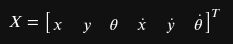
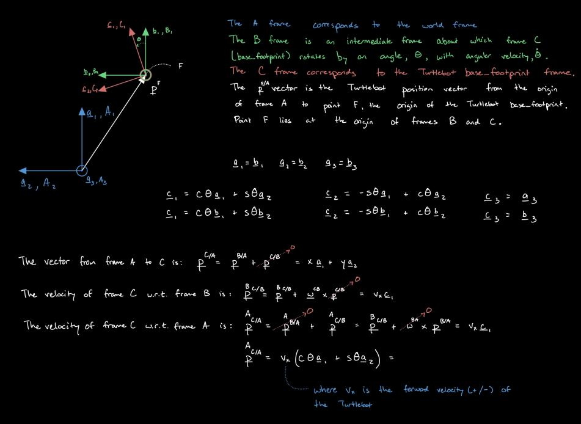
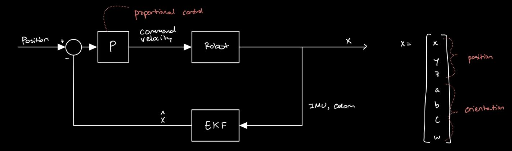

# System Details
## Sensors
1. IMU
    - Rate: 1000 Hz
    - Info: 
        - Quaternion orientation estimate of the base_footprint
        - Vector angular velocity estimate of the base_footprint
        - Vector linear acceleration estimate of the base_footprint
2. Odometery
    - Rate: 30 Hz
    - Info:
        - Vector position of the base_footprint
        - Quaternion orientation of the base_footprint
        - Vector linear velocity of the base_footprint
        - Vector angular velocity of the base_footprint
3. Actual velocity: 
    - Rate: 30 Hz
    - Info: /joint_states gives the position of each wheel from which we can calculate velocity. However, this is a noisy estimate of position, and taking the derivative to get velocity is even noisier. Consider not using this info and using the velocity estimates of the odometry instead.

## Inputs
1. Command velocity: 
    - Rate: 10 Hz using the teleopkey
    - Info: 
        - Linear velocity as an [x, y, z] vector
        - Angular velocity as an [x, y, z] vector

## Truth in Simulation
1. Link States
    - Rate: 1000 Hz
    - Info: /gazebo/link_states at msg.pose[2].position.x (or y or z) and msg.pose[2].orientation.x (or y, z, w). This provides the ground truth to test EKF performance.

## Truth in the Real World
VICON?

## ROS Topics

# System Description
## State

## Actions

## Dynamics

# Motion Planning
## Reward

## Discount Factor

## Horizon

# Design

